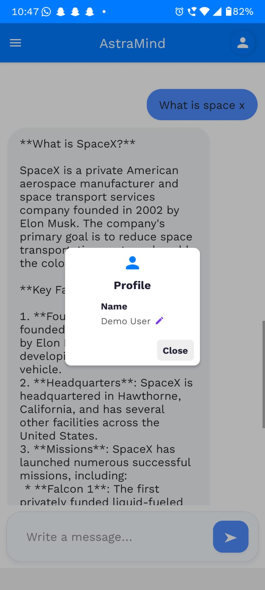
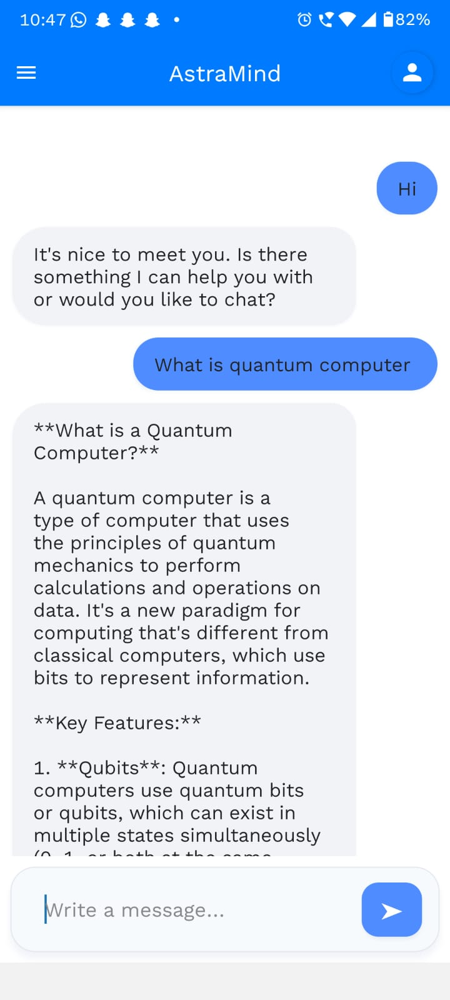
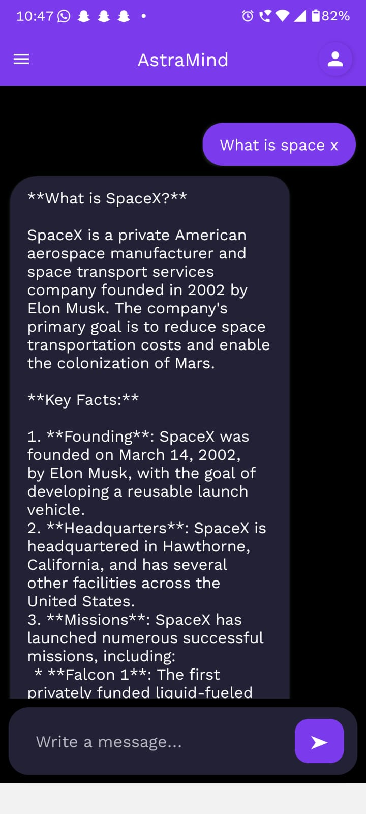
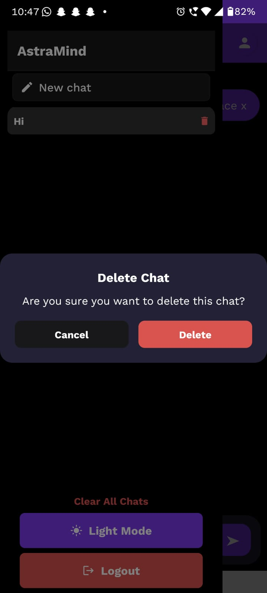
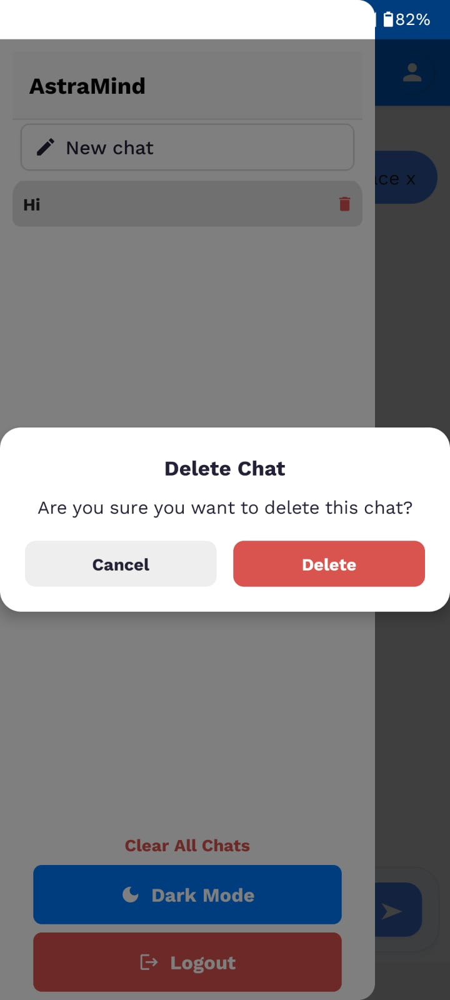

# AstraMind Chat App

## Description

AstraMind is a modern, mobile-friendly chat application built with **React Native**, **Expo**, and **Firebase**. It provides a ChatGPT-style experience with persistent chat history, dark/light themes, and smooth UI animations. The app is currently wired to a Groq-powered assistant behind the scenes, giving you fast AI responses in a familiar chat interface.

## Features
- Secure user authentication (signup/login)
- Persistent chat history (stored locally)
- Custom chat drawer with chat history and new chat button
- Dark mode and light mode support
- Profile editing and logout
- Animated, modern UI

## Screenshots








## Setup Instructions

### Prerequisites
- Node.js (v16 or later)
- npm or yarn
- Expo CLI (`npm install -g expo-cli`)

### Installation
1. Clone the repository:
   ```sh
   git clone <your-repo-url>
   cd chatgpt-clone
   ```
2. Install dependencies:
   ```sh
   npm install
   # or
   yarn install
   ```
3. Start the Expo development server:
   ```sh
   npx expo start
   ```
4. Scan the QR code with the Expo Go app on your mobile device, or run on an emulator.

### Firebase Setup
- The app is pre-configured with Firebase credentials in `src/Services/firebase.js`.
- No additional setup is required for authentication and chat storage.


## Demo Login Credentials

This app is currently set up with dummy login credentials for demo/interview purposes:

- **Email:** `prajakta@gmail.com`
- **Password:** `Prajakta@123`

Signup is disabled in demo mode. Use the above credentials to log in.

---

## Using Your Own Firebase Project

To enable real authentication and persistent chat for your own use:

1. Create a Firebase project at [https://console.firebase.google.com/](https://console.firebase.google.com/)
2. Enable **Email/Password** authentication in the Firebase Authentication section.
3. In your Firebase project settings, find your web app config (apiKey, authDomain, etc).
4. Replace the contents of `src/Services/firebase.js` with your Firebase config and the original Firebase logic (see comments in that file).
5. Run the app. You can now use the Signup screen to create new accounts and log in with real credentials.

**Important:**
- Never commit your real Firebase credentials to a public repository.
- Use environment variables or a secrets manager for production apps.

---

For any issues or questions, please contact the developer or open an issue in the repository.

This is an [Expo](https://expo.dev) project created with [`create-expo-app`](https://www.npmjs.com/package/create-expo-app).

## Get started

1. Install dependencies

   ```bash
   npm install
   ```

2. Start the app

   ```bash
   npx expo start
   ```

In the output, you'll find options to open the app in a

- [development build](https://docs.expo.dev/develop/development-builds/introduction/)
- [Android emulator](https://docs.expo.dev/workflow/android-studio-emulator/)
- [iOS simulator](https://docs.expo.dev/workflow/ios-simulator/)
- [Expo Go](https://expo.dev/go), a limited sandbox for trying out app development with Expo

You can start developing by editing the files inside the **app** directory. This project uses [file-based routing](https://docs.expo.dev/router/introduction).

## Get a fresh project

When you're ready, run:

```bash
npm run reset-project
```

This command will move the starter code to the **app-example** directory and create a blank **app** directory where you can start developing.

## Learn more

To learn more about developing your project with Expo, look at the following resources:

- [Expo documentation](https://docs.expo.dev/): Learn fundamentals, or go into advanced topics with our [guides](https://docs.expo.dev/guides).
- [Learn Expo tutorial](https://docs.expo.dev/tutorial/introduction/): Follow a step-by-step tutorial where you'll create a project that runs on Android, iOS, and the web.

## Join the community

Join our community of developers creating universal apps.

- [Expo on GitHub](https://github.com/expo/expo): View our open source platform and contribute.
- [Discord community](https://chat.expo.dev): Chat with Expo users and ask questions.
